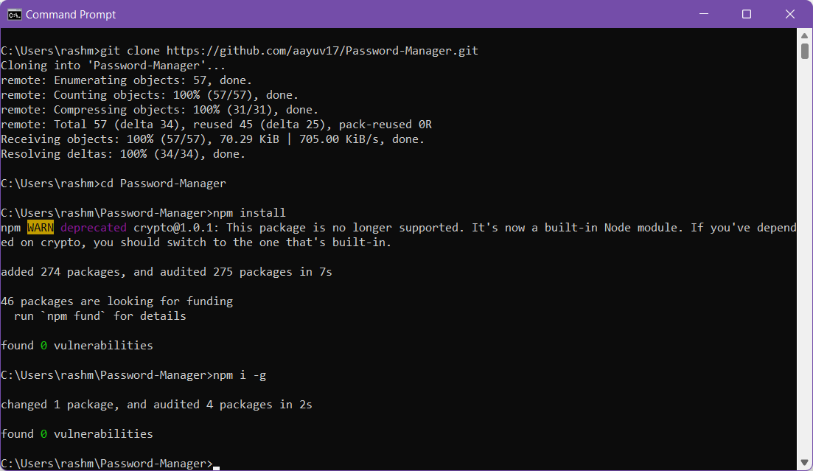
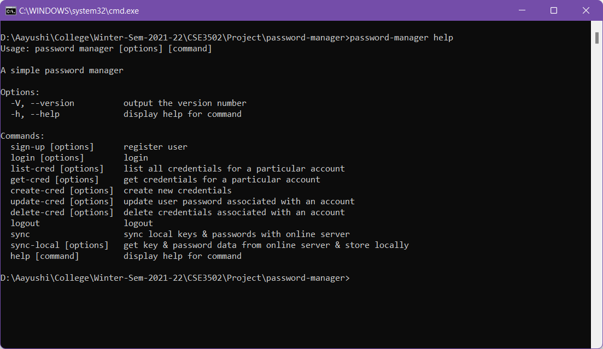
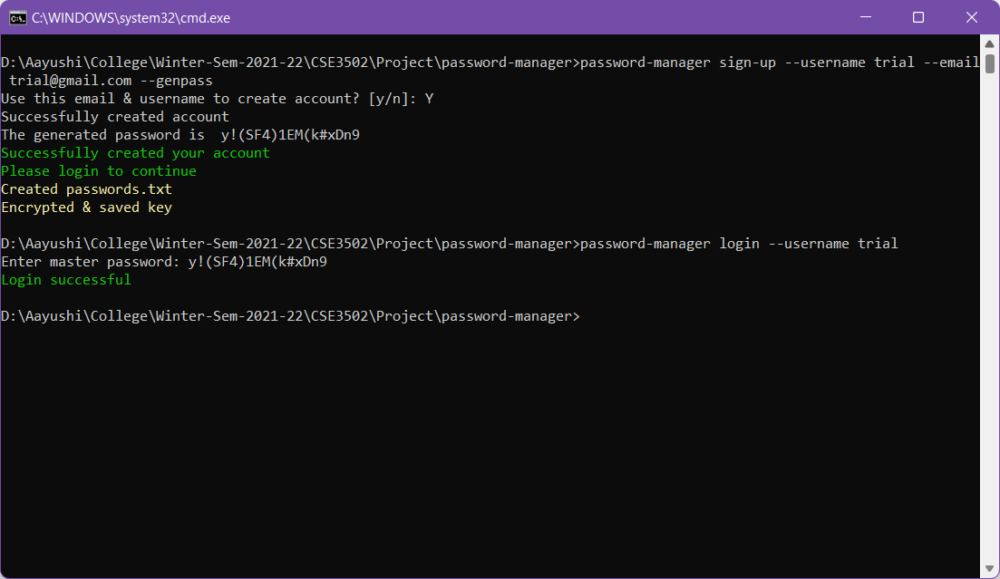
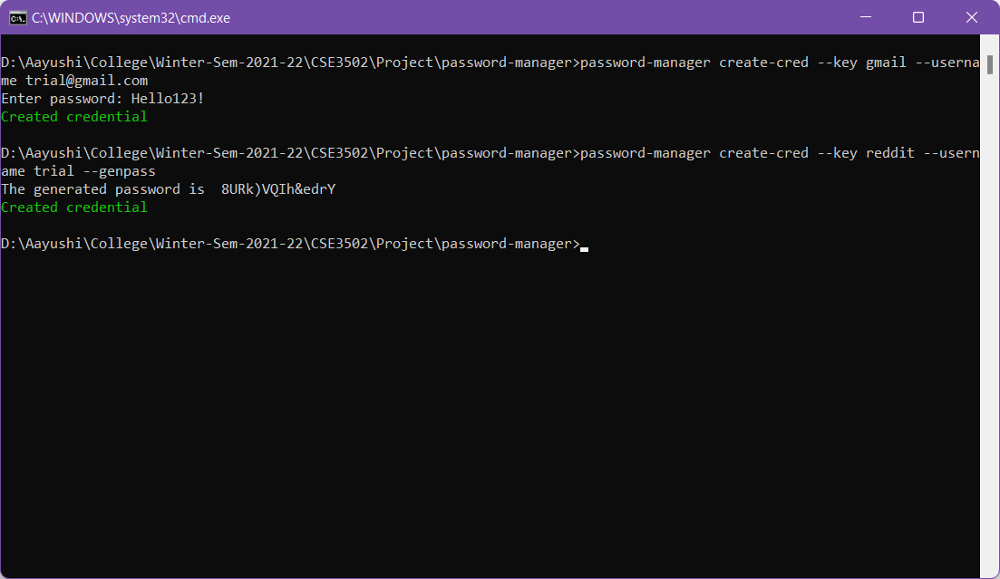
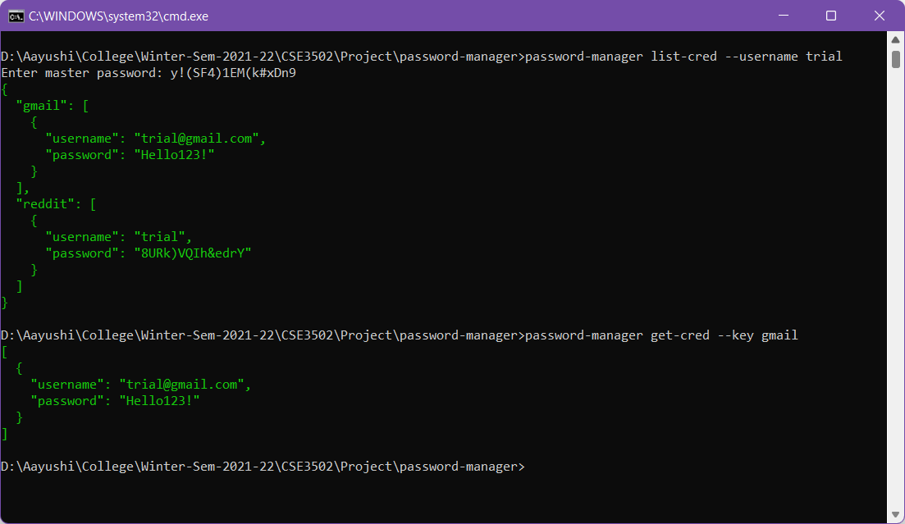
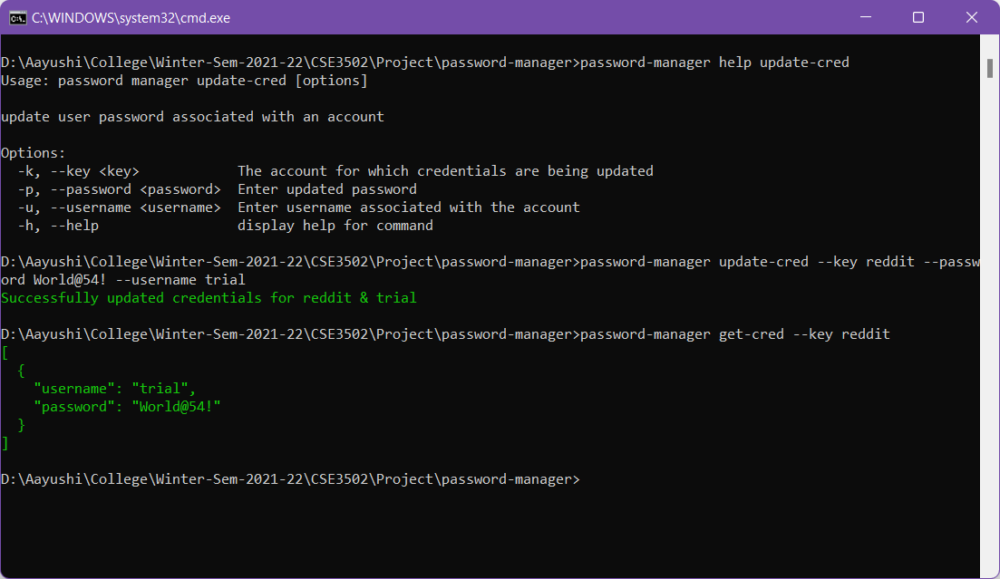
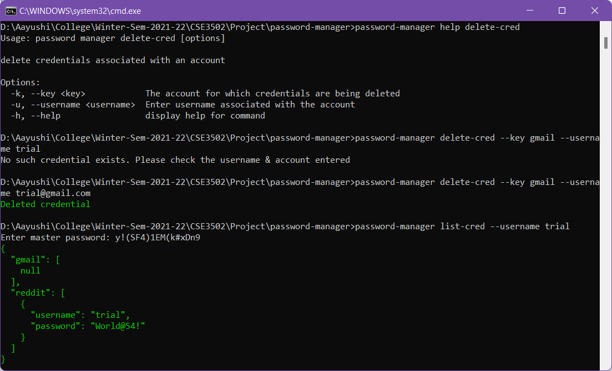
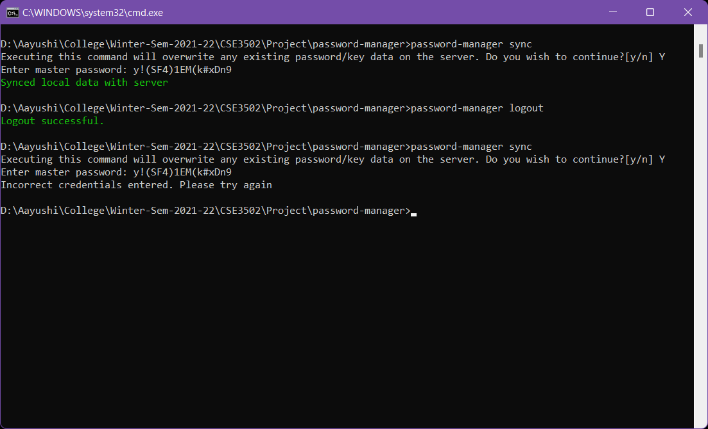
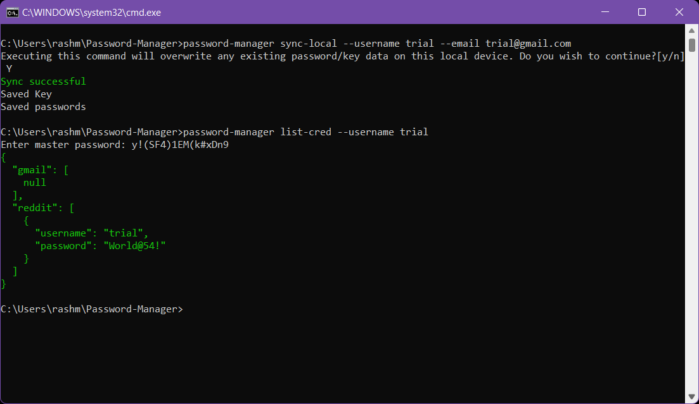

# Password Manager

A password manager based on Zero Knowledge Architecture

## Introduction

Zero Knowledge Architecture refers to the design practice where only the user knows what is stored in their vault and no one else, including the server side vendor, can see the stored information. Encryption is performed using secure cryptographic algorithms on the client side only. So the user's password is essentially never stored in plaintext or sent to the server.

This is an implementation of a node.js based command line tool that acts as a password manager based on Zero Knowledge Architecture.

## Model

The main components of our model are:

- client-side command line tool (implemented using node.js)
- server (implemented using express.js & deployed on Heroku)
- database (mongodb database to store user information)

The cryptographic algorithms used are:

- AES-256 (Symmetric Key Encryption)
- SHA-256 (Password Hashing)

Data stored on the server:

- symmetric key encrypted using master password hash
- passwords encrypted using symmetric key

Data stored on user's local device:

- symmetric key encrypted using master password hash
- passwords encrypted using symmetric key

## Working

1. User is allowed to signup/login with their email & master password. A new symmetric key & passwords.txt file are generated for the user on their local device on signing up.
2. The hash of the master password is used to subsequently encryt/decrypt the symmetric key
3. The decrypted symmetric key is used to subsequently encrypt/decrypt passwords.txt
4. All changes made to the passwords are implemented only locally untill the user pushes the changes to the server (using sync command) or pulls changes from the server (using sync-local command)

## Installation

To install & correctly use this tool:

1. Clone this repository using the command: git clone https://github.com/aayuv17/Password-Manager.git
2. Go to the directory where the clone repository is stored
3. Execute the command: npm install
4. Execute the command: npm i -g

## Usage

- password-manager help

  

- password-manager sign-up // Command to create a new account. Using the --genpass flag assigns a programmatically generated strong password
- password-manager login // Command to log in to a local account

- password-manager create-cred // Command to create a new credential. Using the --genpass flag assigns a programmatically generated strong password

- password-manager list-cred // Command to list all user credentials
- password-manager get-cred // Command to get a specific user credential

- password-manager update-cred // Command to update a credential

- password-manager delete-cred // Command to delete a credential

- password-manager sync // Command to sync local data to online database
- password-manager logout // Command to logout

- password-manager sync-local // Command to sync data from online database to local device to allow users to access passwords from multiple devices

